# Love Them Back
Code Fellows 401 Mid-Term Group Project

## Problem Domain:
A useful web application to help users find and review animals in animal shelters for others to view in an effort to make saving lonely animals easier.  This will allow users to provide a substantial opinion based on personal interactions with the potential pet.

## Deployed Web App and API
### Web App
https://lovethembackwebapp.azurewebsites.net/

### API / Endpoints
https://lovethembackapi2.azurewebsites.net/

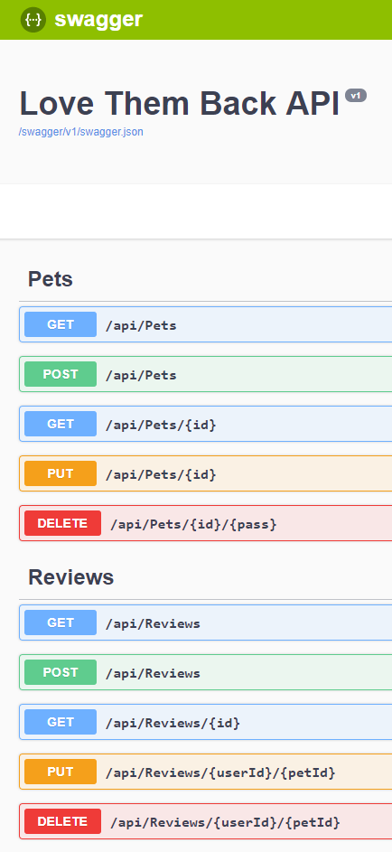

## Team Members:
 Aaron Frank, Carlos Cadena, Danul De Leon, Suzanne Su, Vinh Nguyen

## Contributors
* Amanda, Molly, Jeff, and Greg for being available to help when needed
* The rest of our class for being great rubber ducks and helping solve problems
* The Pet Finder API for giving us all the cute pets within our app

## Tools Used:
* Microsoft .NET Core MVC with Entity Framework
* Visual Studio
* Swagger
* Postman
* Github
* Slack

## Version History:
* 1.0.4 - Styled site
* 1.0.3 - Site pulling from API
* 1.0.2 - Site has base functionality
* 1.0.1 - Deployed Sites
* 1.0.0 - Initial Version

## License
### MIT License
https://opensource.org/licenses/MIT

## Screen Shots:
### Login Page
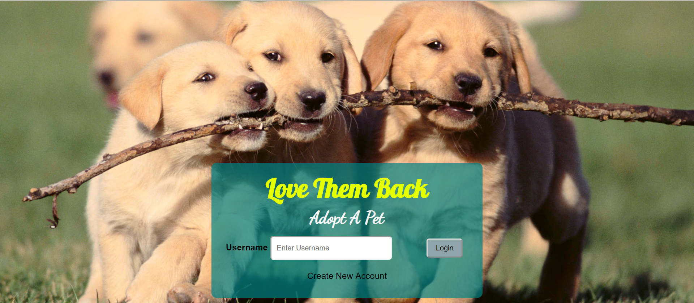

### Register Page
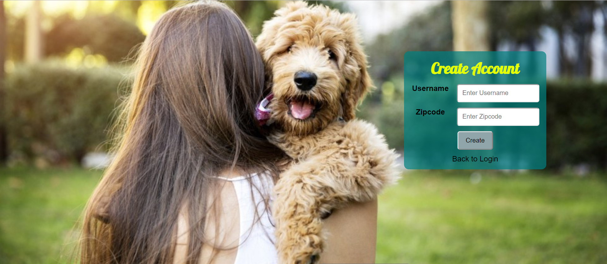

### Pet Search Page
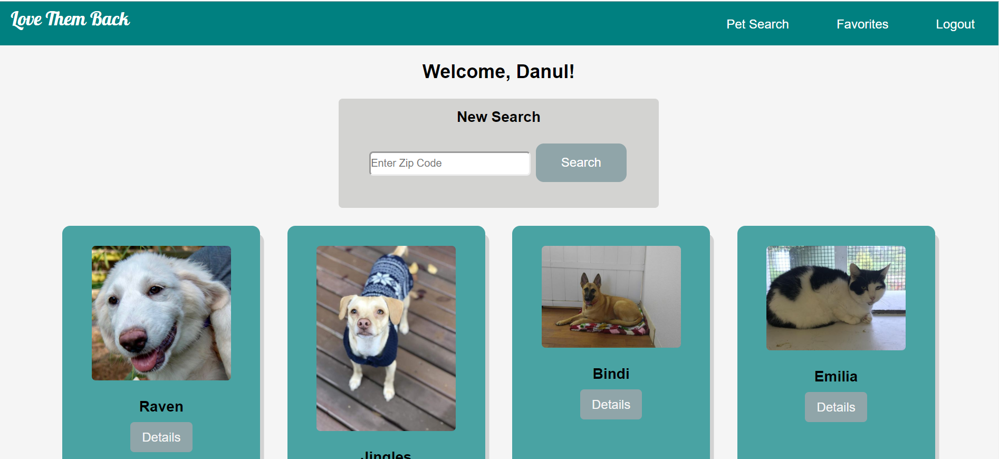

### Pet Details Page
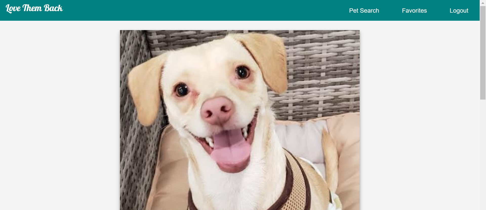
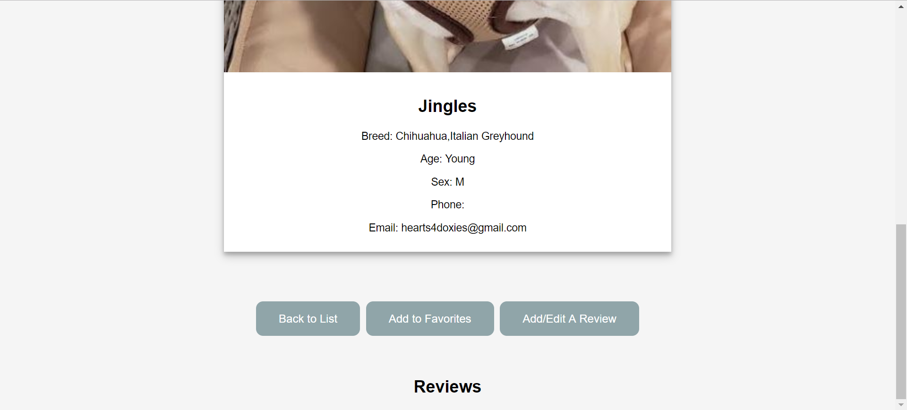

### Favorite Page
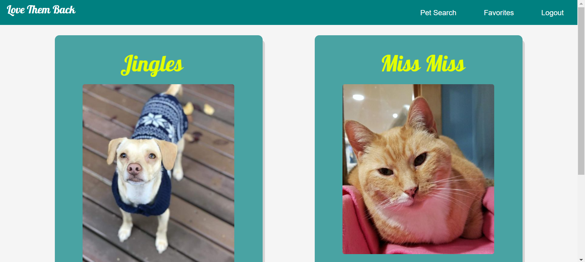

### Create Review Page
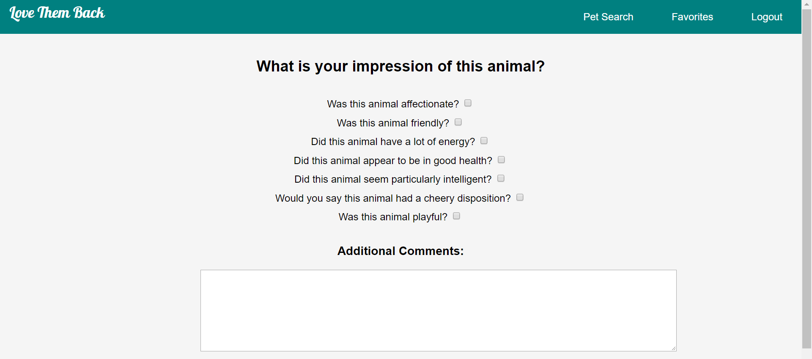

## WireFrames:

### Home Page
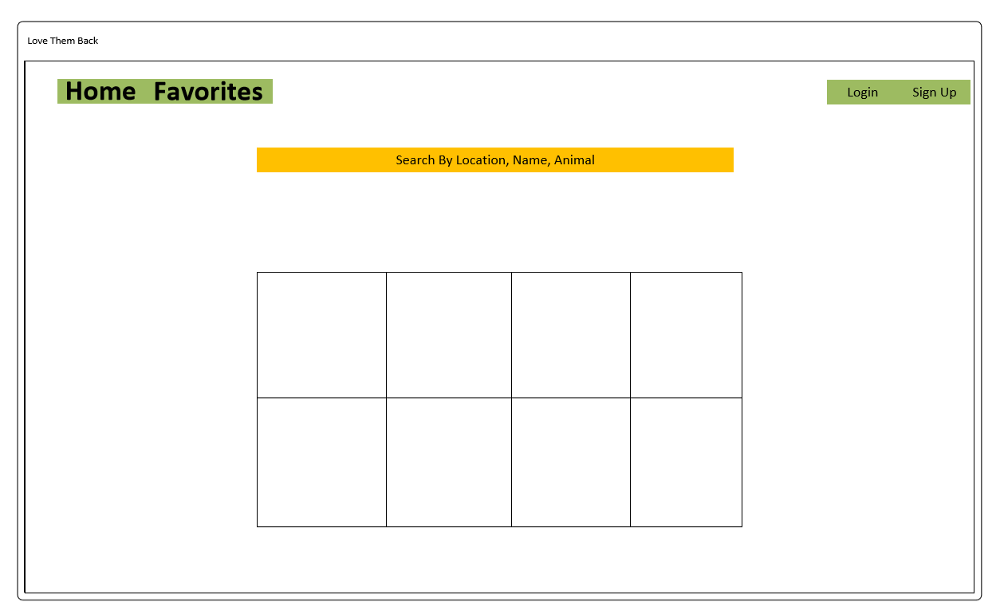

### Profile Page
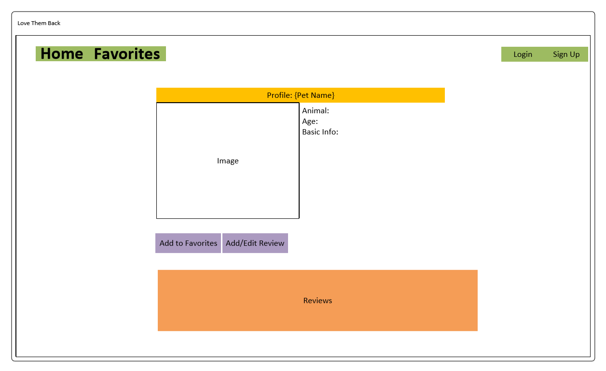

### Favorite Page
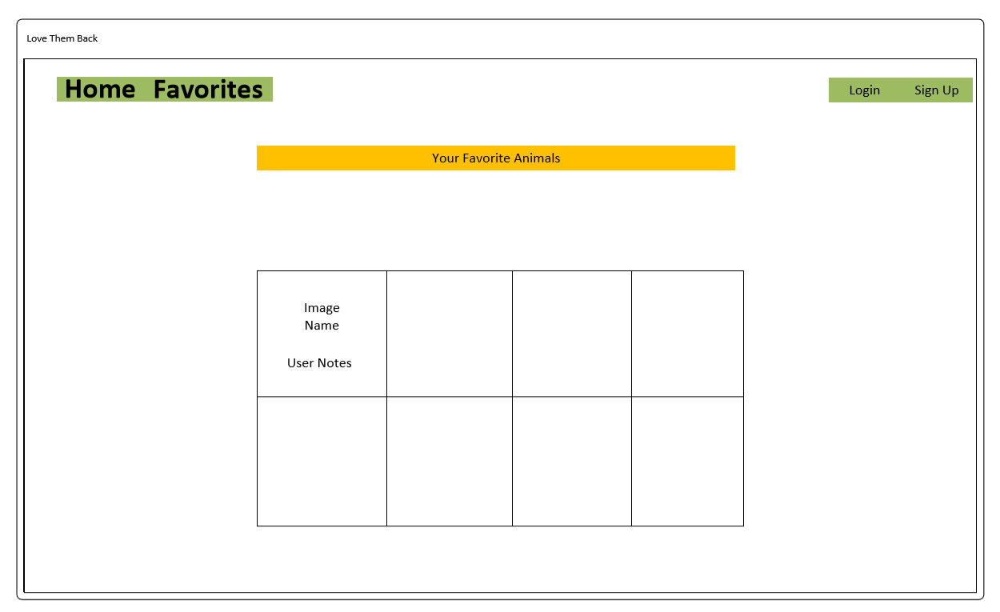

### Create Review Page
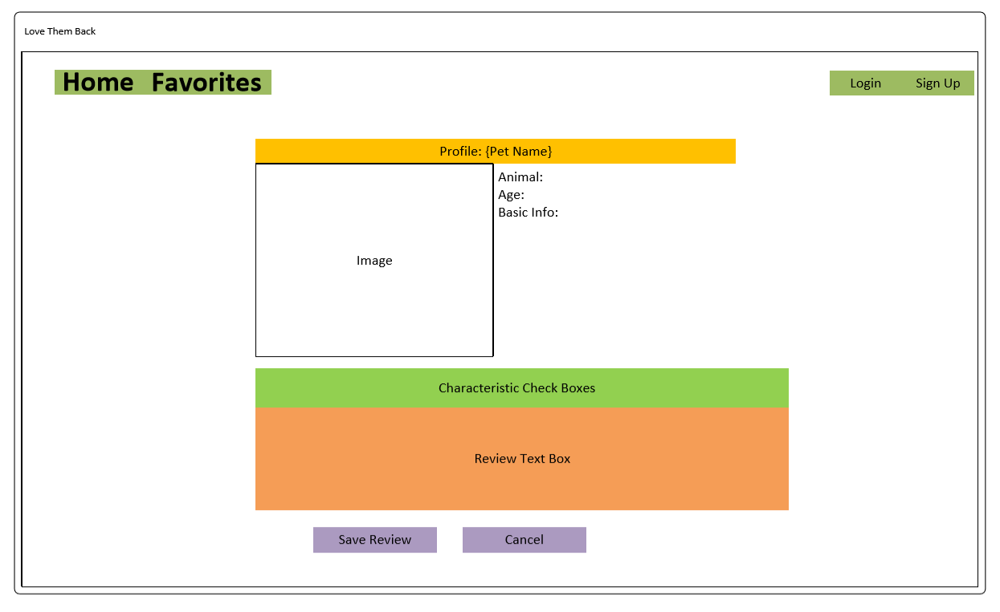

## Database Schema:

### API DB Schema
The Pet table will store information for each pet that is coming from the PetFinder API.  The Name, Gender, Description of the pet will come from the third party API.  The Reviews will come from the web app.  Users will create new notes for the pets and it will be stored. The Reviews table will combine the UserId from the front end and the Pet ID from the other table.  An additional payload will consist of the impression and characteristics of the pet coming from the user.

### Web App DB Schema
The Front end of the web application will store the user profiles consisting of the UserId, the UserName, password(conditional), and zip-code (used for narrowing the pet search down).  This will have a one-to-many relationship to the Favorites table.  This will be a join table consisting of the UserId and the PetId which will be coming from the API.  An additional payload will consist of the Notes made by the user for pets they choose to visit (conditional).

## API Endpoints:
https://lovethembackapi2.azurewebsites.net/swagger  

## User Stories:

### Web App:
#### As a User
1. As a user I would like to be able to create a username in order to have notes associated with my name.
* When a user creates a new user profile they should be redirected to the homepage of the website
2. As a user, I would like to be able to enter a zip code and have the app return a handful (4-5) pets on the front page that are available for adoption/visiting nearby.
* When the user submits a zip code in their search it should refresh the homepage with results of the search shown.
3. As a user, I would like to be able to click on an animal and have the profile of the animal display. (Photo, name, breed, notes)
* When a user clicks on an animal they are redirected to the details page of that animal that has info about it and any user generated comments on that animal.
4. As a user, I would like to be able to see a report from other users on their interaction with a certain pet.
* When a user wants to add a comment about an animal, they can click on an edit button that redirects to the edit animal page. 
5. After a user adds a comment about an animal, they are redirected to the details of that animal which now displays the recently added comment.
* As a user, I would like to be able to see where the shelter the animal is located in is.
6. When a user clicks on an animal from the search results a shelter name should be present on the details view of that animal
* As a user I would like to be able to narrow my search by exactly what kind of animal I’m looking for (dog/cat)
7. In the search results a user should have an option of the kind of animal they want to search for and be able to successfully search for just that type.
* As a user I want to be able to save animal profiles that I may want to come back to in the future
When a user is logged in, the favorites button redirects them to a view that displays the saved animals for that user
8. As a user I want to be able to login and click on a link that takes me to all the animals that I’ve favorited.
* When a user is logged in and clicks on their favorites they should be redirected to a favorites view with all their previously favorited animals and notes attached to them.
9. As a user I want to be able to search by address, city, or zip code to return a helpful list of pets that need love.
* When a user wants to search for animals, they see relatively the same sort of results whether they’re searching by address, city, or zip
10. As a user, I would like to be able to update notes I have made in the past.
* On the favorites page a user should be able to successfully update notes on an animal and it will reflect in the database.
There is an edit view specifically for updating animal notes made by users.

#### As a Developer
1.	As a developer, I would like to have clean and DRY code in order to avoid redundancy and superfluous code resulting in a large file.
* When development is finished, the code does not repeat itself unnecessarily and the code is only what is needed.
2. 	As a developer, I would like to make the user interface as clear as possible so that the user can navigate through without any confusion.
* When a user cna navigate without confusion, it is accepted.
3. 	As a developer, I would like to be able to store the user’s information and notes into a relational database so that I can access their history when they log in again.
* When a user profile is created or favorites are added the correct data should be created/updated in the appropriate table.

### Custom Api:
#### As a User
1. As a user I would like to be able to retrieve reviews on pets up for adoption in the local area to see what their temperament is.
* When a user visits a pet’s details view, data should be pulled in from the proper tables in the api and web app databases needed to show the information.
2. As a user, I would like to be able to post reviews on specific pets.
* When a user creates a review should be stored in the correct table in the API database.
3. As a user, I would like to be able to let other users know some of the personality traits pets I visit have.
* When a user checks different temperaments for pets and submits them they  should be stored in the correct table in the API database.

#### As a Developer
1. As a developer, I would like to be able to create an API that references the pet ID from the PetFinder API to pull in information.
2. As a developer, I would like to create an API that can add User Reviews to the animals selected.

### STRETCH GOALS:
1. Sharing notes made/pets visited on social media.
2. Using Bing API to give directions to the shelter which the animal is located.
3. Link a user to online reading of a specific animal type so that they can learn more before commiting

